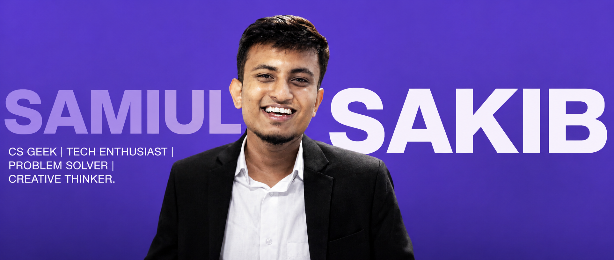

  

<h1 align="center">Hi, I'm Samiul Sakib 👋</h1>

  <b>CS Geek • Tech Enthusiast • Problem Solver • Creative Thinker</b>

  
  

---

## 👨‍💻 About Me

I'm a Computer Science undergrad passionate about building useful software,
solving challenging problems and exploring emerging technologies.

- 🎓 Computer Science Undergraduate
- 💻 Interested in Software Engineering & Backend Development
- 🤖 Exploring Artificial Intelligence & Machine Learning
- 🚀 Building products and experimenting with startup ideas
- 🧠 Love turning complex problems into simple solutions
- 🎨 Interested in UI/UX and creative technology
- 🌱 Always learning something new
- ⚡ Fun fact: I enjoy building things more than just talking about them

---

## 🛠️ Tech Stack

### 👨‍💻 Programming Languages

### 🌐 Web Development

### 🗄️ Databases & Backend

### ⚙️ Tools & Technologies

### 🤖 AI / ML

---

## 🚀 What I'm Currently Working On

### 🏢 Omnistra

Working on **Omnistra**, an AI-first customer experience and sales
orchestration platform.

The goal is to build intelligent systems that can determine whether an
interaction should be automated, assisted by AI, or escalated to a human.

**Exploring:**

- AI-powered customer experience
- Conversational AI
- Backend architecture
- Event-driven systems
- Real-time applications
- Intelligent automation
- Scalable APIs

---

## 🔥 Featured Projects

### 💰 FundBridge

A platform designed to connect **founders and investors** while providing
structured investment workflows and transaction tracking.

**Focus:** FinTech • Real-Time Systems • Supabase • Backend Architecture

---

### 🎓 Smart Campus Lost & Found

A campus-focused Lost & Found management system that allows users to report,
search, match, claim, and track lost or found items.

**Tech:** Node.js • Express.js • MySQL • JavaScript

---

### 🌍 More Projects

I'm continuously building and experimenting with projects across:

- Software Engineering
- Backend Development
- AI / ML
- Web Applications
- Developer Tools
- Automation
- Startup Products

👉 Check out my repositories to see what I'm currently building.

---

## 📊 GitHub

---

## 🔥 Contribution Streak

  

---

## 📈 GitHub Activity

  

  

---

## 🧠 Currently Learning

- Backend Architecture
- FastAPI
- SQLAlchemy
- PostgreSQL
- Redis
- Docker
- REST API Design
- Event-Driven Architecture
- Distributed Systems
- AI / ML Integration

---

## 🎯 Areas of Interest

💻 Software Engineering &nbsp; • &nbsp;
🤖 Artificial Intelligence &nbsp; • &nbsp;
🌐 Web Development

 

⚙️ Backend Systems &nbsp; • &nbsp;
🗄️ Databases &nbsp; • &nbsp;
🎨 UI/UX

 

🚀 Startups &nbsp; • &nbsp;
🧠 Problem Solving &nbsp; • &nbsp;
💡 Creative Technology

---

## 🤝 Let's Connect

---

  <i>Build. Break. Learn. Improve. Repeat. 🚀</i>

  Thanks for visiting my profile!

